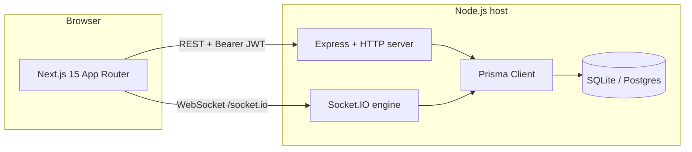

# TaskForge Enterprise

**A full-stack, portfolio-grade team task management SaaS foundation** built as an **npm monorepo**: a **Next.js 15** (App Router) client and an **Express 4** API with **Prisma ORM**, **JWT authentication**, **REST + WebSocket (Socket.IO)** collaboration, and a **SQLite** database for frictionless local development with a documented path to **PostgreSQL** in production. A **[live demo](#live-demo)** on **Vercel** (frontend) and **Render** (API) exposes the same architecture publicly (split origins, HTTPS, CORS, and Socket.IO).

This document is written to serve both **recruiters** and **engineers**: it explains *what* was built, *why* key choices were made, and *how* to install, run, extend, and deploy the system.

---

## Live Demo

The production stack uses **[Vercel](https://vercel.com)** for the **Next.js 15** frontend (`web/`) and **[Render](https://render.com)** for the **Express + Prisma + Socket.IO** API (`api/`). The browser loads the UI from the frontend origin, then calls the API for **REST** (JSON + JWT) and **WebSockets** (Socket.IO on `/socket.io/`). Set **`WEB_ORIGIN`** on the API to the Vercel origin (CORS) and **`NEXT_PUBLIC_API_URL`** on the web build to the public API base URL (no trailing slash). Details: [§11 Environment variables](#11-environment-variables).

### Frontend (Vercel)

**URL:** [https://task-forge-web-lwqx.vercel.app](https://task-forge-web-lwqx.vercel.app)

Hosts the full **App Router** experience: landing, **register / login**, demo shortcuts, and the **dashboard** (overview, Kanban with **@dnd-kit**, calendar, **Recharts** analytics, notifications, realtime **chat** client, settings).

### Backend API (Render)

**URL:** [https://task-forge-jlpv.onrender.com](https://task-forge-jlpv.onrender.com)

Hosts **Express** routes (`/health`, `/auth`, `/projects`, `/tasks`, `/notifications`, `/analytics`, `/users`, …), **Zod**-validated inputs, **Prisma** persistence, and **Socket.IO** attached to the same HTTP server as the REST app.

### Health Check

[https://task-forge-jlpv.onrender.com/health](https://task-forge-jlpv.onrender.com/health) — should return JSON liveness.

### Demo Login

**Admin**

- Email: `admin@demo.com`
- Password: `Admin123`

**Member**

- Email: `member@demo.com`
- Password: `Member123`

After the API database is **migrated and seeded** on Render, these accounts work in production. One-click demo URLs are in [§15 Demo data and credentials](#15-demo-data-and-credentials).

---

## Table of contents

**Production:** [Live Demo](#live-demo) · Local run: [§12 Installation and local operation](#12-installation-and-local-operation)

1. [Executive summary](#1-executive-summary)  
2. [Problem statement and goals](#2-problem-statement-and-goals)  
3. [High-level architecture](#3-high-level-architecture)  
4. [Technology stack and rationale](#4-technology-stack-and-rationale)  
5. [Repository layout](#5-repository-layout)  
6. [Data model (Prisma)](#6-data-model-prisma)  
7. [Backend implementation](#7-backend-implementation)  
8. [Frontend implementation](#8-frontend-implementation)  
9. [Authentication and session model](#9-authentication-and-session-model)  
10. [Realtime chat (Socket.IO)](#10-realtime-chat-socketio)  
11. [Environment variables](#11-environment-variables)  
12. [Installation and local operation](#12-installation-and-local-operation)  
13. [Build, lint, and quality gates](#13-build-lint-and-quality-gates)  
14. [HTTP API reference](#14-http-api-reference)  
15. [Demo data and credentials](#15-demo-data-and-credentials)  
16. [Security considerations](#16-security-considerations)  
17. [Known limitations and technical debt](#17-known-limitations-and-technical-debt)  
18. [Troubleshooting](#18-troubleshooting)  
19. [Deployment guide](#19-deployment-guide)  
20. [Roadmap (beyond current scope)](#20-roadmap-beyond-current-scope)  
21. [Attribution and naming](#21-attribution-and-naming)

---

## 1. Executive summary

TaskForge Enterprise implements a **multi-tenant-style workspace** at the data layer (Organization → Projects → Tasks) with **role-based access** at the API boundary. The web application provides:

- Marketing **landing** experience  
- **Registration and login** with JWT access and refresh tokens  
- A **protected dashboard** with shared **project selection** (persisted in `localStorage`)  
- **Overview** (projects CRUD subset, task table, status updates)  
- **Kanban** board with drag-and-drop status changes  
- **Calendar** month view derived from task due dates (fallback: created date)  
- **Analytics** dashboards backed by server-side aggregates  
- **Notifications** inbox with read/unread actions  
- **Org-scoped team chat** over Socket.IO with in-memory history for demos  
- **Settings** to update the user display name  

The backend exposes **REST** JSON endpoints and hosts **Socket.IO** on the **same HTTP server** as Express, which simplifies local development and single-origin deployment patterns.

---

## 2. Problem statement and goals

**Problem:** Demonstrate ability to design and ship a **credible SaaS slice**: not a single CRUD page, but **auth**, **authorization-scoped data**, **multiple UX surfaces** (table, board, calendar, charts), and **realtime** behavior, with code that could evolve toward a commercial product.

**Goals achieved in this repository:**

| Goal | How it is addressed |
|------|---------------------|
| Clear separation of concerns | Monorepo: `web` (UI) vs `api` (business logic + persistence) |
| Typed end-to-end contracts | TypeScript in both workspaces; Zod validation on API inputs |
| Persistent domain model | Prisma schema with enums and relations |
| Secure password handling | bcrypt cost factor 12 on register; compare on login |
| Stateless API auth | JWT access token + refresh token |
| Operational hygiene | Helmet, CORS, JSON body size cap, rate limiting |
| Demonstrable UX | Dashboard shell, Kanban, calendar, analytics, chat, notifications |

---

## 3. High-level architecture

The browser talks to the **Next.js** application for UI. The UI calls the **Express API** over HTTP (and Socket.IO for chat). Prisma mediates all database access. SQLite stores rows in `api/prisma/dev.db` when using the default `DATABASE_URL`.



**Request flow (REST):** Client attaches `Authorization: Bearer <accessToken>`. If the access token expires, the client library attempts `POST /auth/refresh` with the refresh token, updates stored tokens, and retries the original request once.

**Connection flow (Socket.IO):** Client connects to the same origin host/port as the API (`NEXT_PUBLIC_API_URL`), path `/socket.io/`, with `auth: { token: <accessToken> }`. The server verifies the JWT in middleware, loads the user’s `organizationId`, joins room `org:<id>`, and relays `chat:message` events to that room.

---

## 4. Technology stack and rationale

### 4.1 Frontend (`web/`)

| Technology | Role |
|------------|------|
| **Next.js 15.3.x** | App Router, static generation where applicable, fast iteration in dev |
| **React 19** | UI composition |
| **TypeScript** | Type safety for components and hooks |
| **Tailwind CSS** | Utility-first styling for SaaS layout |
| **@dnd-kit/core** | Pointer-based drag-and-drop for Kanban |
| **recharts** | Responsive charts for analytics |
| **socket.io-client** | Realtime chat transport |

### 4.2 Backend (`api/`)

| Technology | Role |
|------------|------|
| **Express 4** | HTTP routing, middleware pipeline |
| **TypeScript (ESM)** | `type: "module"`, `tsx` for dev watch |
| **Prisma 6** | ORM, migrations-ready schema |
| **Zod** | Request body and query validation |
| **jsonwebtoken** | Access + refresh signing and verification |
| **bcryptjs** | Password hashing |
| **helmet** | Default security headers |
| **cors** | Cross-origin policy (production uses `WEB_ORIGIN`; dev allows localhost / 127.0.0.1 variants) |
| **express-rate-limit** | Basic abuse throttling |
| **socket.io** | WebSocket + polling fallback for chat |

### 4.3 Monorepo orchestration (root)

| Tool | Role |
|------|------|
| **npm workspaces** | `web` and `api` as packages |
| **npm-run-all** (`run-p`) | Parallel `dev:web` and `dev:api` without fragile Windows `cmd.exe` coupling |

---

## 5. Repository layout

```text
.
├── package.json                 # Workspaces + scripts: dev, build, lint, db:*
├── README.md                    # This document
├── .gitignore                   # Ignores node_modules, .env, dev.db, .next, dist
├── web/                         # Next.js frontend
│   ├── package.json
│   ├── next.config.ts
│   ├── tailwind.config.ts
│   ├── tsconfig.json
│   ├── .env.example             # NEXT_PUBLIC_API_URL
│   └── src/
│       ├── app/
│       │   ├── layout.tsx       # Root layout, fonts, Providers (AuthProvider)
│       │   ├── providers.tsx
│       │   ├── globals.css
│       │   ├── page.tsx         # Public landing
│       │   ├── login/page.tsx   # Forms + demo auto-login (?demo=admin|member)
│       │   ├── signup/page.tsx
│       │   └── dashboard/
│       │       ├── layout.tsx   # Auth gate + ProjectProvider + Shell
│       │       ├── page.tsx     # Overview: projects + task table
│       │       ├── kanban/page.tsx
│       │       ├── calendar/page.tsx
│       │       ├── analytics/page.tsx
│       │       ├── notifications/page.tsx
│       │       ├── chat/page.tsx
│       │       └── settings/page.tsx
│       ├── components/          # dashboard-auth, dashboard-shell
│       ├── contexts/            # auth-context, dashboard-project-context
│       └── lib/                 # config, auth-storage, api client, chat-socket
└── api/                         # Express backend
    ├── package.json
    ├── prisma/
    │   ├── schema.prisma
    │   ├── seed.ts
    │   └── dev.db               # Generated locally (gitignored)
    ├── .env.example
    └── src/
        ├── index.ts             # HTTP server + routes + Socket attach
        ├── socket.ts            # Socket.IO auth + org rooms + chat relay
        ├── config/env.ts        # Zod-validated environment
        ├── lib/prisma.ts        # Singleton Prisma client
        ├── middleware/auth.ts   # Bearer JWT guard
        ├── routes/              # auth, health, projects, tasks, notifications, analytics, users
        └── utils/               # jwt, projectAccess, accessibleProjects
```

---

## 6. Data model (Prisma)

**Enums:**

- `UserRole`: `SUPER_ADMIN`, `PROJECT_ADMIN`, `TEAM_LEAD`, `MEMBER`  
- `TaskPriority`: `LOW`, `MEDIUM`, `HIGH`, `CRITICAL`  
- `TaskStatus`: `PENDING`, `IN_PROGRESS`, `REVIEW`, `COMPLETED`  
- `ProjectMethodology`: `AGILE`, `SCRUM`, `KANBAN`, `WATERFALL`  

**Core entities:**

- **User** — identity, `passwordHash`, `role`, optional `organizationId`, optional `settings` JSON.  
- **Organization** — workspace; `ownerId`; optional `teams` JSON for flexible team metadata.  
- **Project** — belongs to `organizationId`; has `adminId`; `methodology`, `deadline`, `progress`.  
- **ProjectMember** — many-to-many between users and projects (unique `[projectId, userId]`).  
- **Task** — belongs to `projectId`; optional `assigneeId`; optional JSON fields for future subtasks/comments/attachments.  
- **Notification** — per-user rows with `type`, `message`, `read`.  

**Access pattern (implemented in code):** A user sees projects where they are either **project admin** or listed in **ProjectMember**, and the project’s `organizationId` matches the user’s `organizationId`. Tasks are listed and mutated only if the user passes the same project gate (`getProjectForUser`).

---

## 7. Backend implementation

### 7.1 Entry point (`src/index.ts`)

- Constructs the Express `app` with middleware order: **Helmet → CORS → JSON parser → rate limiter → routers → 404**.  
- Creates `http.Server` via `createServer(app)` and passes it to `attachSocketIO` so REST and WebSockets share the port.  
- Listens on `env.PORT` (default **4000**).

### 7.2 Route modules

| Router | Mount path | Responsibility |
|--------|------------|----------------|
| `healthRouter` | `/health` | Liveness JSON |
| `authRouter` | `/auth` | Register, login, refresh, `me` |
| `projectsRouter` | `/projects` | List/create projects within org + membership rules |
| `tasksRouter` | `/tasks` | List (by `projectId`), create, patch status/title |
| `notificationsRouter` | `/notifications` | List; `POST /read-all` before `PATCH /:id/read` to avoid route shadowing |
| `analyticsRouter` | `/analytics` | `GET /overview` aggregates over accessible project IDs |
| `usersRouter` | `/users` | `PATCH /me` display name |

### 7.3 Cross-cutting concerns

- **CORS:** `WEB_ORIGIN` is allowed in all environments; in **development**, any origin whose host is `localhost` or `127.0.0.1` is accepted to reduce friction when switching hostnames or ports during local testing.  
- **JWT:** Separate secrets for access vs refresh; expiry strings parsed via Zod and passed to `jsonwebtoken` with explicit typing for `SignOptions`.  
- **Prisma:** Single shared client in `lib/prisma.ts` with dev-time global guard to avoid hot-reload connection explosion.

### 7.4 Socket.IO (`src/socket.ts`)

- **Handshake auth:** `socket.handshake.auth.token` must be a valid access JWT.  
- **Room model:** Users with an `organizationId` join `org:<organizationId>`.  
- **Events:** `chat:history` (on connect), `chat:message` (broadcast + append to bounded in-memory ring per org).  
- **Persistence:** In-memory only (demo); restarting the API clears chat history.

---

## 8. Frontend implementation

### 8.1 App Router structure

- **Public routes:** `/`, `/login`, `/signup`.  
- **Protected subtree:** `/dashboard/*` wrapped by `DashboardAuth` (redirect to `/login` if no session).  
- **Shell:** `DashboardShell` provides sidebar (desktop), mobile nav strip, project `<select>`, logout.  
- **Shared project state:** `DashboardProjectProvider` loads `/projects` once, keeps `selectedProjectId` in React state and **`localStorage` key `tf_selected_project`** so Kanban/Calendar/Overview stay aligned.

### 8.2 Auth layer (`contexts/auth-context.tsx`)

- On mount: if `localStorage` has access token, call `/auth/me`.  
- `login` / `register`: raw `fetch` to API (no circular dependency), then `setTokens` + set user.  
- `logout`: clear tokens and user.  
- `refreshSession`: re-fetch `/auth/me` after profile updates.

### 8.3 API client (`lib/api.ts`)

- Injects `Authorization: Bearer` from `localStorage`.  
- On **401**, attempts refresh once, retries request.  
- `apiJson` throws with parsed error messages for UI feedback.

### 8.4 Feature pages (summary)

| Route | Implementation notes |
|-------|----------------------|
| `/dashboard` | Project cards, create project (non-`MEMBER`), task table, create task, status `<select>` |
| `/dashboard/kanban` | DnD Kit `DndContext` + `closestCenter`; columns = statuses; drag updates via `PATCH /tasks/:id` |
| `/dashboard/calendar` | Pure React month grid (no FullCalendar dependency after v6 CSS export issues with this toolchain) |
| `/dashboard/analytics` | `GET /analytics/overview` + Recharts bar + pie |
| `/dashboard/notifications` | List + `PATCH` single read + `POST /read-all` |
| `/dashboard/chat` | `socket.io-client`; cleanup disconnects on unmount |
| `/dashboard/settings` | `PATCH /users/me` then `refreshSession()` |

### 8.5 Login UX extras

- **Demo Admin / Demo Member** one-click buttons.  
- **Query auto-login:** `/login?demo=admin` and `/login?demo=member` (wrapped in `<Suspense>` for `useSearchParams`).  
- **React Strict Mode:** Auto-login effect does not use a one-shot ref that blocks the second effect run (avoids “stuck on login” in dev).

---

## 9. Authentication and session model

**Tokens:**

- Stored in browser **`localStorage`** as `tf_access_token` and `tf_refresh_token` (see `web/src/lib/auth-storage.ts`).  

**Trade-off (documented):** This is simple for demos and portfolio hosting. **Production hardening** would typically move access tokens to **httpOnly cookies** and/or use a **BFF** (Next.js Route Handlers) to avoid exposing long-lived refresh logic to XSS surfaces.

**Protected UI:** `DashboardAuth` gates `/dashboard/*`. Middleware-based protection was not required for the current scope because tokens live client-side.

---

## 10. Realtime chat (Socket.IO)

**Client:** `getChatSocket()` in `web/src/lib/chat-socket.ts` builds a singleton `io(getApiUrl(), { path: '/socket.io/', auth: { token } })`.

**Server:** `attachSocketIO` in `api/src/socket.ts` attaches to the shared `http.Server`.

**Scaling note:** In-memory chat history does not scale horizontally; Redis adapter + persistent message store would be the next engineering step.

---

## 11. Environment variables

### 11.1 API (`api/.env`)

| Variable | Required | Description |
|----------|----------|-------------|
| `DATABASE_URL` | Yes | Default local: `file:./dev.db` (relative to `api/prisma` usage via Prisma) |
| `PORT` | No | Default `4000` |
| `NODE_ENV` | No | `development` / `production` |
| `WEB_ORIGIN` | No | Default `http://localhost:3000` — used for CORS allowlist |
| `JWT_ACCESS_SECRET` | Yes | Min 16 chars |
| `JWT_REFRESH_SECRET` | Yes | Min 16 chars |
| `JWT_ACCESS_EXPIRES` | No | Default `15m` |
| `JWT_REFRESH_EXPIRES` | No | Default `7d` |

**Live API (Render):** Point `WEB_ORIGIN` at the exact frontend origin from [Live Demo](#live-demo)—for example `https://task-forge-web-lwqx.vercel.app`—so **CORS** and **Socket.IO** from that site succeed.

### 11.2 Web (`web/.env.local`)

| Variable | Required | Description |
|----------|----------|-------------|
| `NEXT_PUBLIC_API_URL` | No | Defaults to `http://localhost:4000` in `src/lib/config.ts` |

**Live deployment:** The production build in [Live Demo](#live-demo) sets `NEXT_PUBLIC_API_URL` to `https://task-forge-jlpv.onrender.com` (no trailing slash) so the hosted Next.js app calls the hosted Express API.

---

## 12. Installation and local operation

### 12.1 Prerequisites

- **Node.js** 20 LTS or newer recommended  
- **npm** 10+  

### 12.2 Clone and install

```bash
cd /path/to/repo
npm install
```

### 12.3 API environment file

**POSIX:**

```bash
cp api/.env.example api/.env
```

**Windows PowerShell:**

```powershell
copy api\.env.example api\.env
```

Edit `api/.env` and set strong random values for both JWT secrets.

### 12.4 Database schema and seed

```bash
cd api
npx prisma db push
npx prisma db seed
cd ..
```

Or from root:

```bash
npm run db:push -w api
npm run db:seed -w api
```

### 12.5 Web environment (optional)

```bash
cp web/.env.example web/.env.local
```

### 12.6 Run both services

From repository root:

```bash
npm run dev
```

- **Web:** http://localhost:3000  
- **API + Socket.IO:** http://localhost:4000  

---

## 13. Build, lint, and quality gates

```bash
npm run build -w api
npm run build -w web
npm run lint -w web
npm run lint -w api
```

**Next.js build cache:** If `next build` fails with odd prerender errors (for example favicon-related), delete `web/.next` and rebuild:

```powershell
Remove-Item -Recurse -Force web\.next
npm run build -w web
```

---

## 14. HTTP API reference

**Base URL (local):** `http://localhost:4000`  
**Base URL (this repository’s Render API):** `https://task-forge-jlpv.onrender.com`  

Append paths from the table below to whichever base you use (no trailing slash on the origin).

| Method | Path | Auth | Body / query | Success |
|--------|------|------|--------------|---------|
| GET | `/health` | No | — | `{ ok, service }` |
| POST | `/auth/register` | No | `{ name, email, password }` | 201 + user + tokens |
| POST | `/auth/login` | No | `{ email, password }` | 200 + user + tokens |
| POST | `/auth/refresh` | No | `{ refreshToken }` | 200 + new tokens |
| GET | `/auth/me` | Bearer | — | `{ user }` |
| GET | `/projects` | Bearer | — | `{ projects: [...] }` |
| POST | `/projects` | Bearer | `{ title, description?, methodology?, deadline? }` | 201 (blocked for `MEMBER`) |
| GET | `/tasks` | Bearer | `?projectId=` | `{ tasks: [...] }` |
| POST | `/tasks` | Bearer | `{ projectId, title, ... }` | 201 |
| PATCH | `/tasks/:id` | Bearer | `{ status?, title? }` | 200 |
| GET | `/notifications` | Bearer | — | `{ notifications: [...] }` |
| POST | `/notifications/read-all` | Bearer | — | `{ ok: true }` |
| PATCH | `/notifications/:id/read` | Bearer | — | `{ ok: true }` |
| GET | `/analytics/overview` | Bearer | — | `{ totalProjects, totalTasks, overdueTasks, byStatus, byPriority }` |
| PATCH | `/users/me` | Bearer | `{ name }` | `{ user }` |

---

## 15. Demo data and credentials

| Role | Email | Password |
|------|-------|----------|
| Admin (project admin in seed) | `admin@demo.com` | `Admin123` |
| Member | `member@demo.com` | `Member123` |

The seed script creates **Demo Workspace**, links users, a sample **project** with **tasks**, and **notifications**. Re-running seed removes prior demo rows for those emails and workspace name to avoid duplicates.

**Quick demo URLs (local):**

- http://localhost:3000/login?demo=admin  
- http://localhost:3000/login?demo=member  

**Quick demo URLs (production — Vercel frontend):**

- https://task-forge-web-lwqx.vercel.app/login?demo=admin  
- https://task-forge-web-lwqx.vercel.app/login?demo=member  

*(Requires the deployed API database to be seeded with the same demo users.)*

---

## 16. Security considerations

Implemented:

- Password hashing (bcrypt).  
- JWT access + refresh separation.  
- Helmet, CORS policy, JSON size limit, rate limiting.  
- Project/task routes enforce **membership / admin** checks before reads and writes.  
- Socket.IO connection rejects missing or invalid JWT.

Not implemented (intentional roadmap):

- OAuth, 2FA, password reset email flows.  
- httpOnly cookie session model.  
- CSRF strategy for cookie-based auth.  
- Field-level audit logs.  
- Production-grade chat ACL beyond org room.

---

## 17. Known limitations and technical debt

| Item | Detail |
|------|--------|
| SQLite in dev | Single-file DB; not ideal for high write concurrency |
| JWT in `localStorage` | Convenient but XSS-sensitive compared to httpOnly cookies |
| Chat history | Ephemeral across API restarts |
| Calendar | Custom grid instead of FullCalendar (dependency + bundler friction at time of build) |
| `MEMBER` cannot create projects | By design; org onboarding flow not built |
| New self-registered users | Default `MEMBER` without org — empty project list until assigned |

---

## 18. Troubleshooting

| Symptom | Likely cause | Mitigation |
|---------|--------------|------------|
| `EADDRINUSE` on port 4000 / 3000 | Old Node process still bound | Stop other dev servers; Windows: `Get-NetTCPConnection -LocalPort 4000,3000` then `Stop-Process -Id <pid> -Force` |
| CORS errors from browser | `WEB_ORIGIN` mismatch | Set `WEB_ORIGIN` to exact browser origin (scheme + host + port) |
| `Failed to fetch` | API not running or wrong `NEXT_PUBLIC_API_URL` | Verify `/health`; fix `.env.local` |
| Login works but dashboard empty (new user) | No `organizationId` | Use seeded accounts or extend backend to assign orgs |
| `next build` favicon / prerender errors | Stale `.next` | Delete `web/.next` and rebuild |

---

## 19. Deployment guide

### 19.0 This repository’s live stack (Vercel + Render)

The **[Live Demo](#live-demo)** URLs reflect the maintainer’s deployment pattern: **Vercel** for the Next.js frontend and **Render** for the Node API. In that setup:

- **Frontend (Vercel):** root directory `web/`, set **`NEXT_PUBLIC_API_URL`** to `https://task-forge-jlpv.onrender.com` (or your own API URL), deploy.  
- **API service (Render):** build/start `api/` with **`DATABASE_URL`**, **`JWT_ACCESS_SECRET`**, **`JWT_REFRESH_SECRET`**, and **`WEB_ORIGIN`** set to `https://task-forge-web-lwqx.vercel.app` (exact scheme + host; no path) so CORS and Socket.IO from the browser succeed.  
- Run **Prisma** migrations (and optionally **seed**) on the API service so `/health`, auth, and demo users behave as documented.

The subsections below (**PostgreSQL**, **Railway-style API**, **Vercel for Next.js**) remain the general reference for other hosts; the same environment variables and origins apply.

### 19.1 Database (production)

1. Provision **PostgreSQL**.  
2. Set `DATABASE_URL` to the provider connection string.  
3. In `api/prisma/schema.prisma`, change:

   ```prisma
   datasource db {
     provider = "postgresql"
     url      = env("DATABASE_URL")
   }
   ```

4. Run migrations in CI or on the host: `npx prisma migrate deploy` (after creating migrations in dev).

### 19.2 API (example: Railway)

- **Root directory:** monorepo root.  
- **Build:** `npm ci` (or install) + `npm run build -w api` + `npx prisma generate` as needed.  
- **Start:** `npm run start -w api` (runs `node dist/index.js`).  
- **Environment:** copy from `api/.env.example` and set production secrets.

### 19.3 Web on Vercel (step-by-step)

Vercel runs **Next.js only**. The **Express + Socket.IO API** must already be deployed somewhere public (for example **Railway**, **Render**, or **Fly.io**) with **HTTPS**. The browser will call that URL via `NEXT_PUBLIC_API_URL` and open WebSockets to the same host.

#### 19.3.1 Prerequisites

1. GitHub (or GitLab / Bitbucket) repo pushed with this monorepo.  
2. A **live API base URL** like `https://taskforge-api-xxxx.up.railway.app` (no trailing slash).  
3. On the API host, set **`WEB_ORIGIN`** to your **exact** Vercel site origin after first deploy, e.g. `https://taskforge-web.vercel.app` (scheme + host, no path). This is required for **CORS** and for **Socket.IO** browser connections.

#### 19.3.2 Create the Vercel project

1. Go to [vercel.com](https://vercel.com) → **Add New…** → **Project**.  
2. **Import** your Git repository.  
3. Under **Configure Project**:  
   - **Root Directory:** set to **`web`** (important: not the monorepo root, unless you use advanced custom commands).  
   - **Framework Preset:** Next.js (auto-detected from `web/package.json`).  
   - **Build Command:** `npm run build` (default).  
   - **Output:** Next.js default (leave as-is).  
   - **Install Command:** `npm install` (default). Vercel runs this **inside** `web/`, which is correct because `web/package.json` lists all frontend dependencies.

`web/vercel.json` pins the framework to Next.js for clarity.

#### 19.3.3 Environment variables (Vercel dashboard)

In the project → **Settings** → **Environment Variables**, add for **Production** (and Preview if you want):

| Name | Example value | Notes |
|------|----------------|-------|
| `NEXT_PUBLIC_API_URL` | `https://your-api.up.railway.app` | **No** trailing slash. Must be the public API origin your Express app listens on. |

Redeploy after changing env vars (**Deployments** → … → **Redeploy**).

#### 19.3.4 First deploy and CORS fix loop

1. Click **Deploy**. Wait for the build to finish.  
2. Open your Vercel URL (e.g. `https://xxx.vercel.app`). If the UI loads but API calls fail, open the browser **Network** tab:  
   - **CORS error** → update API **`WEB_ORIGIN`** to match the **exact** Vercel URL (including `https://`), restart API, redeploy if needed.  
   - **404 / connection refused** → wrong `NEXT_PUBLIC_API_URL` or API not running.  
3. **Chat (Socket.IO):** requires the API to accept WebSocket upgrades on the same public URL. Most PaaS defaults work; if chat fails only in production, check provider docs for WebSocket support.

#### 19.3.5 Monorepo alternative (advanced)

If you insist on connecting Vercel at the **repository root** instead of `web/`:

- **Install command:** `npm install` (installs workspaces from root `package.json`).  
- **Build command:** `npm run build -w web`  
- **Output directory:** not the static `out` folder — Next on Vercel expects the project root to be the Next app. This setup is error-prone; **prefer Root Directory = `web`**.

#### 19.3.6 Production database for the API

The **Vercel** deploy does not run Prisma. Your **API host** must set `DATABASE_URL` to **PostgreSQL** in production (see §19.1), run `prisma migrate deploy`, and run seed once if you need demo data.

### 19.4 Socket.IO behind proxies

Ensure WebSocket upgrade headers are forwarded (Railway/Vercel typically OK; custom Nginx needs `proxy_http_version 1.1` and `Upgrade`/`Connection` headers).

---

## 20. Roadmap (beyond current scope)

Prioritized extensions that match a “Jira / ClickUp class” product narrative:

1. OAuth (Google/GitHub) + email verification.  
2. Password reset + transactional email (SendGrid/Nodemailer) + queue (BullMQ).  
3. httpOnly cookie auth or Next.js BFF for tokens.  
4. Task comments and activity feed persisted in DB.  
5. File uploads (Cloudinary/S3) wired to `Task.attachments`.  
6. Gantt view and/or FullCalendar with a vetted CSS pipeline.  
7. Redis-backed Socket adapter + persistent chat.  
8. Billing UI (Stripe) and org-level subscription state.  
9. E2E tests (Playwright) and OpenAPI spec generation.

---

## 21. Attribution and naming

The product name **TaskForge Enterprise** is used in UI metadata and documentation. Rename in `web/src/app/layout.tsx` and marketing copy if you standardize on another brand.

---

## Appendix A — Root npm scripts

| Script | Command |
|--------|---------|
| `dev` | `run-p dev:web dev:api` |
| `build` | `npm run build -w web && npm run build -w api` |
| `lint` | `npm run lint -w web && npm run lint -w api` |
| `db:generate` | Prisma client generate in `api` |
| `db:migrate` | Prisma migrate dev in `api` |
| `db:seed` | Run seed in `api` |

---

## Appendix B — Screenshots and demo video (placeholders)

For portfolio submission, capture:

1. Landing page  
2. Login + auto-demo path  
3. Dashboard overview with tasks  
4. Kanban drag between columns  
5. Calendar month  
6. Analytics charts  
7. Notifications  
8. Chat with two browsers side-by-side  
9. Settings name change reflected in shell  
10. Deployment dashboard (e.g. Render, Vercel + Railway)

Store assets under `docs/` or link from your portfolio site when available.

---

*End of document.*
